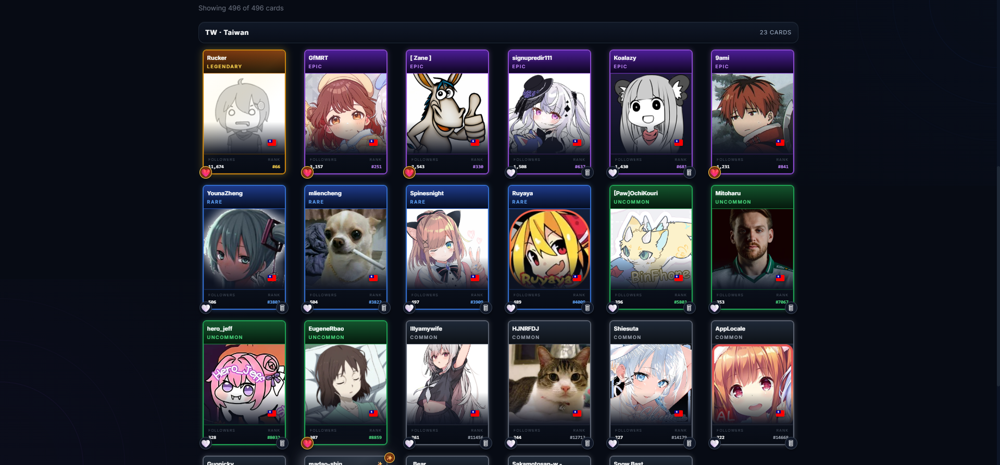

<a id="readme-top"></a>

<div align="center">

# osu!gacha Country Tools

A Chrome extension for `gacha.miz.to` that adds country grouping, country filters, collection utilities, and an optional auto-open-packs toggle.

</div>

## Table of Contents

1. [About The Project](#about-the-project)
2. [Preview](#preview)
3. [Features](#features)
4. [Getting Started](#getting-started)
5. [Installation](#installation)
6. [Usage](#usage)
7. [Roadmap](#roadmap)
8. [License](#license)
9. [Acknowledgments](#acknowledgments)

## About The Project

`gacha.miz.to` already exposes useful collection data such as country codes, rarity, follower count, and rank, but the default UI is limited when you want to browse your collection by country or quickly automate repetitive actions.

This extension improves the site without replacing its existing UI. It keeps the original cards and controls intact, then layers additional tooling on top of the collection and pull pages.


## Preview

The screenshot below shows the collection page grouped by country, with the `TW · Taiwan` section displayed as a clean card grid instead of a flat mixed list.

<div align="center">
  
</div>

## Features

- Group collection cards by country inside the existing grid
- Filter loaded cards by country
- Sort cards by rank, followers, rarity, or name
- Load all cards for the current collection view
- Copy currently visible usernames
- Popup menu with an `Auto Open Packs` toggle
- Persistent settings via Chrome storage

### Built With

- Manifest V3
- Vanilla JavaScript
- Chrome Extension APIs
- Existing `gacha.miz.to` page DOM and `/api/collection`

## Getting Started

This project does not need a build step. You can load it directly as an unpacked Chrome extension.

### Prerequisites

- Google Chrome or another Chromium-based browser
- Access to `https://gacha.miz.to/`
- A downloaded or cloned copy of this repository

## Installation

### Option 1: Download ZIP from GitHub

This is the easiest GitHub-based install flow for most users.

1. Open the repository on GitHub.
2. Click `Code`.
3. Click `Download ZIP`.
4. Extract the ZIP to a normal folder.
5. Open `chrome://extensions/`.
6. Enable `Developer mode`.
7. Click `Load unpacked`.
8. Select the extracted project folder.

Important:
- You cannot install this directly from a `.zip` file.
- Chrome requires the folder to be extracted first for `Load unpacked`.

### Option 2: Clone the repository

```bash
git clone https://github.com/EricChangOwO/osu-gacha-country-tools.git
```

Then load the cloned folder in `chrome://extensions/` with `Load unpacked`.

### More convenient installation?

If you want something easier than `Download ZIP` + `Extract` + `Load unpacked`, the real answer is:

- Publish it to the Chrome Web Store

That is the only genuinely simpler install path for regular users. A packaged `.crx` file is possible, but it is usually more awkward and less reliable than either `Load unpacked` or the Chrome Web Store.

For now, the best non-store flow is:

- GitHub Release with a ZIP
- User extracts it
- User installs with `Load unpacked`

## Usage

### Collection Page

- Use the injected toolbar above the search box.
- Toggle `Group by country` to insert country section headers into the existing grid.
- Pick a country from the dropdown or quick chips.
- Change sorting with `Rank`, `Followers`, `Rarity`, or `Name`.
- Click `Load all cards` to fully load the current collection view.
- Click `Copy visible names` to copy the usernames currently visible on screen.

### Extension Popup

- Click the extension icon in Chrome.
- Turn on `Auto Open Packs`.
- On the pull page, the extension will check once per second for:
  - `Open Pack`
  - `Open Next Pack`
- If the button exists and is enabled, it clicks it automatically.

### Notes

- Country grouping uses the site's own collection data, not OCR or screenshot parsing.
- The extension works against the current page view. If the site has not rendered a player into the DOM yet, the extension cannot visually place that card until the site loads it.
- After editing extension files locally, reload the extension in `chrome://extensions/` before testing again.

## Roadmap

- Add more popup toggles for pull-page automation
- Add export options such as CSV or JSON
- Add country stats summaries in the popup
- Add optional favorites-only and rarity-only quick filters

## License

No license file has been added yet.

If you plan to publish this repository publicly on GitHub, add a license before sharing it broadly.

## Acknowledgments

- [Best README Template](https://github.com/othneildrew/Best-README-Template)
- [gacha.miz.to](https://gacha.miz.to/)
- [flag-icons](https://github.com/lipis/flag-icons)
